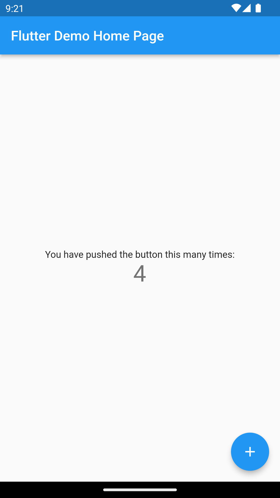

# first_app

A new Flutter project.

## Getting Started

This project is a starting point for a Flutter application.

A few resources to get you started if this is your first Flutter project:

- [Lab: Write your first Flutter app](https://flutter.dev/docs/get-started/codelab)
- [Cookbook: Useful Flutter samples](https://flutter.dev/docs/cookbook)

## Screenshot/Output >>
|  |   |
| ------------ | ------------ |

## Flutter command >> 
- Follow dart package naming convention with lowercase_and_underscore, az09 and name should not start with digits or reserved word.
- `` mkdir flutterproject ``
- `` flutter create app_name ``
- `` cd app_name ``
- `` flutter doctor ``
- `` flutter run ``
- `` flutter emulators ``
- `` flutter devices ``
- `` flutter pub get ``
- `` flutter pub upgrade ``
- `` flutter clean ``
- `` flutter --version ``

## Useful Git Command >>
- `` git init ``
- `` git add . ``
- `` git commit -m "message" ``
- `` git push origin master ``
- `` git status ``
- `` git fetch ``
- `` git config --global user.email "youremail@example.com" ``
- `` git remote add origin url.git ``
- `` git pull origin master ``
- `` git --version ``
- `` git remote -v ``

## Resources >>
- **[flutter documentation](https://flutter.dev/docs)**
- **[dart documentation](https://dart.dev)**
- **[Dart online editor](https://dartpad.dev)**
- **[stackoverflow](https://stackoverflow.com)**
- **[Material Design](https://material.io)**
- **[Appicon](https://appicon.co)**
- **[FlutterIcon](https://www.fluttericon.com)**
- **[Flutlab.io | Build flutter projects online](https://flutlab.io/)**

For help getting started with Flutter, view our
[online documentation](https://flutter.dev/docs), which offers tutorials,
samples, guidance on mobile development, and a full API reference.
